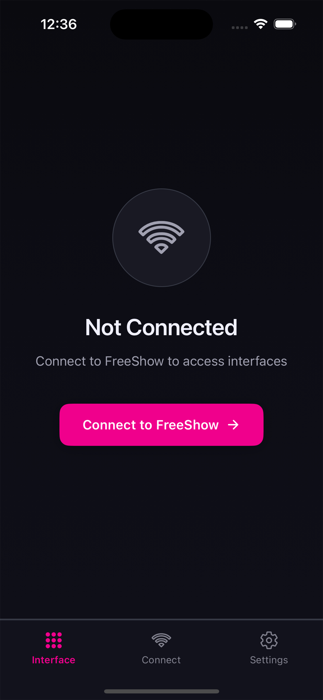
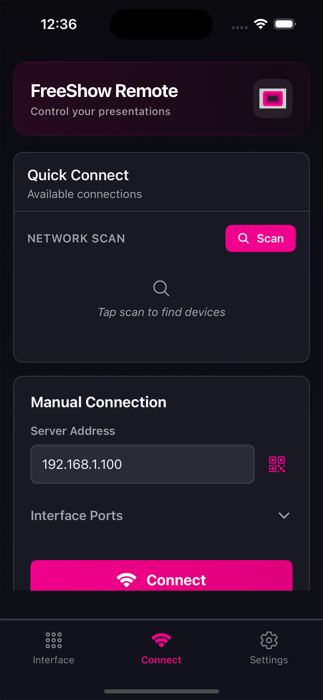
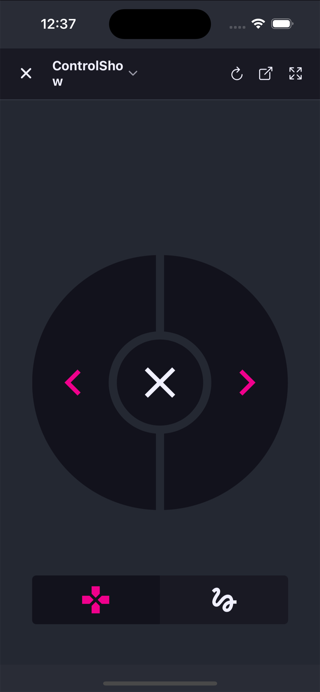
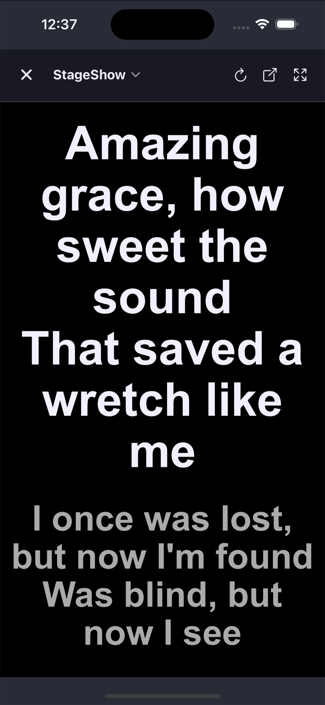

# FreeShow Remote


> FreeShow Remote is the mobile companion app for [FreeShow](https://freeshow.app) presentation software. Control your presentations wirelessly from your iOS or Android device with features including slide navigation, stage display viewing, and auto-discovery of FreeShow instances on your local network.

## Preview

   

## Features

- **Auto-Discovery**: Automatically find FreeShow instances on your network using Zeroconf/Bonjour
- **Manual Connection**: Connect via QR code or manual IP address entry
- **Remote Control**: Navigate slides, control presentation playback, and manage shows
- **Stage Display**: View stage display content directly on your mobile device
- **Cross-Platform**: Available for iOS (iPhone & iPad), Android (Phone & Tablet), and TV platforms (Android TV, Fire TV)
- **Dark Mode**: Beautiful dark interface optimized for various lighting conditions
- **Quick Actions**: Fast access to recently connected servers

## Get Involved

### 🤝 Help Support Us

Please consider supporting our work. It takes a lot of time and effort to develop and maintain this software. Here are a few ways you can contribute:

- [Become a partner](https://churchapps.org/partner)
- [GitHub Sponsors](https://github.com/sponsors/ChurchApps)

### 🏘️ Join the Community

- Visit the [FreeShow Facebook Group](https://www.facebook.com/groups/freeshowapp) to ask questions, get tips, and see how others are using FreeShow.

### ⚠️ Report an Issue

- If you discover an issue or have a feature request, visit the [ChurchAppsSupport Issues log](https://github.com/ChurchApps/ChurchAppsSupport/issues).

### 💬 Join us on Slack

- If you would like to get involved contributing in any way, head over to our [Slack Channel](https://join.slack.com/t/livechurchsolutions/shared_invite/zt-i88etpo5-ZZhYsQwQLVclW12DKtVflg) and introduce yourself.

### 🏗️ Start Coding

1. Install dependencies:
   ```bash
   npm install
   ```

2. Start the development server:
   ```bash
   npm start
   ```

3. Run on your device or simulator:
   ```bash
   npm run ios      # iOS simulator
   npm run android  # Android emulator
   ```

## Release Builds

### Android

1. Update version in `app.json` and `package.json`
2. Run version sync script:
   ```bash
   npm run version
   ```
3. Build for Android:
   ```bash
   npm run build:android    # Google Play (AAB)
   npm run build:amazon     # Amazon Appstore (APK)
   ```
4. Submit to stores:
   ```bash
   npm run submit:android
   ```

### iOS

1. Update version numbers:
   - Update `version` in `package.json`
   - Update `CFBundleShortVersionString` in `app.json` → `ios.infoPlist`
   - Increment `CFBundleVersion` (build number) in `app.json` → `ios.infoPlist`

2. Build for iOS:
   ```bash
   npm run build:ios
   ```

3. Submit to App Store:
   ```bash
   npm run submit:ios
   ```


## Credits

Special thanks to [Gladson Sam](https://github.com/gladsonsam) for doing the development work to create the initial version of this project.
